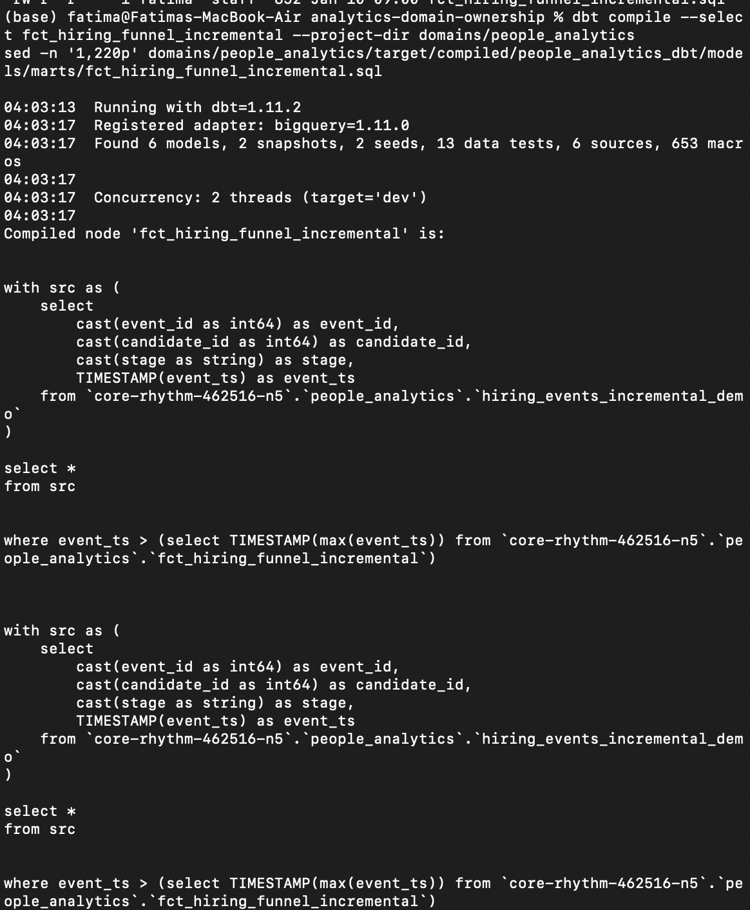

# Analytics Domain Ownership  
**dbt · BigQuery · Airflow · CI · Data Contracts**

[](https://github.com/FATIMA-FARMAN/analytics-domain-ownership/actions/workflows/dbt-ci.yml)

End-to-end analytics engineering portfolio demonstrating **domain ownership** for a **People Analytics** domain using production-grade patterns: **staging → intermediate → marts**, **tests + contracts**, **Airflow orchestration**, and **CI-backed proof**. The domain is isolated under `domains/people_analytics/` (models, tests, seeds, snapshots, and DAGs).

---

## What this proves

- Owns an analytics **domain end-to-end**
- Designs **staging → intermediate → marts (dim/fct)** intentionally
- Implements **incremental models** under BigQuery Sandbox constraints
- Enforces **data contracts & tests**
- Orchestrates dbt workflows with **Airflow**
- Ships **verifiable proof**, not claims

---

## Proof / Evidence (recruiter scan)

- ✅ **dbt test execution proof (PASS=13)**  
  - 

- ✅ **Incremental compiled SQL proof (BigQuery Sandbox)**  
  - `assets/proof/compiled_fct_hiring_funnel_incremental.sql`  
  - 

- ✅ **Incremental demo seed + incremental model implementation**  
  - `domains/people_analytics/seeds/hiring_events_incremental_demo.csv`  
  - `domains/people_analytics/models/marts/fct_hiring_funnel_incremental.sql`

- ✅ **Contracts/tests hardened for key marts**  
  - `domains/people_analytics/models/marts/schema.yml` (key marts + contract-style checks)

---

## Architecture & lineage


## What this project demonstrates

- **Domain ownership (data-product layout)**  
  The People Analytics domain lives under `domains/people_analytics/` with isolated **models, tests, seeds, snapshots, macros, and orchestration assets**. This structure mirrors a domain-owned data product: clear boundaries, clear ownership, and reusable artifacts.

- **Warehouse modeling discipline**  
  The project implements a deliberate **staging → intermediate → marts** architecture. Models are separated by responsibility (cleaning vs enrichment vs serving), with **intentional materialization choices** to balance **cost, performance, and reuse**.

- **Data quality & governance**  
  **Schema contracts and dbt tests** enforce reliability for downstream consumers. Coverage includes standard constraints like **`not_null`**, **`unique`**, and **`accepted_values`**, plus **model-level contracts** where appropriate for “analytics-ready” tables.

- **Operational workflows**  
  **Airflow DAGs** orchestrate dbt runs/tests to demonstrate production-style operations. Generated artifacts (e.g., `venv/`, `logs/`, `target/`) are excluded from version control to
----------

analytics-domain-ownership/
  domains/
    people_analytics/
      dags/
      macros/
      models/
        staging/
        intermediate/
        marts/
      seeds/
      snapshots/
      tests/
      packages.yml
  assets/
    proof/

## Cost-aware warehouse notes (BigQuery)

This repository is intentionally structured to demonstrate **cost-aware analytics engineering** on BigQuery—optimizing for **lower scan cost**, **predictable materialization**, and **fast iteration**.

### Incremental model note (BigQuery Sandbox)

The hiring funnel fact is implemented as a **dbt incremental model** using a timestamp-based filter.

BigQuery Sandbox (free tier) blocks DML operations required for incremental runs (e.g., **MERGE / INSERT**). As a result:

- `dbt compile` demonstrates correct incremental SQL generation  
- `dbt run --full-refresh` succeeds (DDL only)  
- Standard incremental runs require billing to execute  

This is a **warehouse limitation**, not a modeling issue.

---

### Materialization strategy

- **Staging (`stg_*`)** → materialized as **views**  
- **Intermediate (`int_*`)** → materialized as **tables** only when reused  
- **Marts (`dim_*`, `fct_*`)** → **views or tables** depending on access patterns and performance needs  

---

### Query efficiency principles

- Avoid `SELECT *` in marts to reduce **bytes scanned**
- Centralize expensive joins and transformations in reusable intermediate models
- Optimize marts for **BI-friendly consumption** and interactive performance

---

### Partitioning & clustering (production pattern)

For large fact tables:

- **Partition** by a date column (e.g., `event_date`, `snapshot_date`)
- **Cluster** by common join or filter keys (e.g., `employee_id`, `department_id`)
- **Result:** lower scan cost and faster interactive queries

---

### CI as a cost guardrail

To avoid unnecessary warehouse spend on every change:

- GitHub Actions runs `dbt deps` + `dbt parse` as lightweight validation
- Run **targeted** `dbt test` on key marts instead of full refreshes

```mermaid
flowchart TB

  subgraph ORCH["Airflow Orchestration"]
    DAG["dag_dbt_people_domain"] --> DEPS["dbt deps"] --> RUN["dbt run"] --> TEST["dbt test"]
  end

  subgraph SRC["Sources"]
    HRIS["HRIS"]
    ATS["ATS"]
    PERF["Performance"]
    COMP["Compensation"]
  end

  subgraph STG["Staging"]
    STG_HRIS["stg_hris_employees"]
    STG_ATS["stg_ats_candidates"]
    STG_PERF["stg_perf_reviews"]
    STG_COMP["stg_comp_salaries"]
  end

  subgraph INT["Intermediate"]
    INT_EMP["int_employee_enriched"]
    INT_FUN["int_hiring_funnel_steps"]
  end

  subgraph MART["Marts"]
    DIM_EMP["dim_employee"]
    FCT_FUN["fct_hiring_funnel"]
  end

  HRIS --> STG_HRIS
  ATS --> STG_ATS
  PERF --> STG_PERF
  COMP --> STG_COMP

  STG_HRIS --> INT_EMP --> DIM_EMP
  STG_ATS --> INT_FUN --> FCT_FUN


