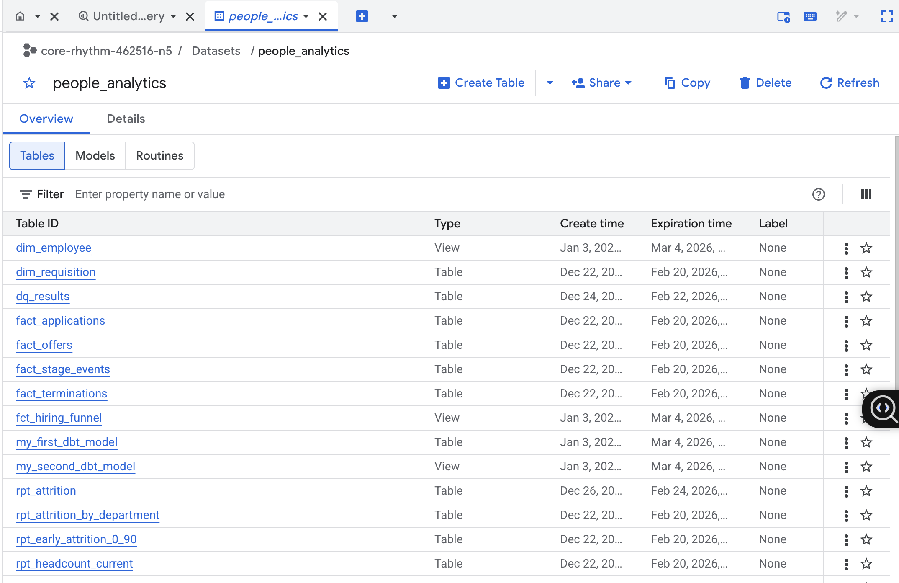
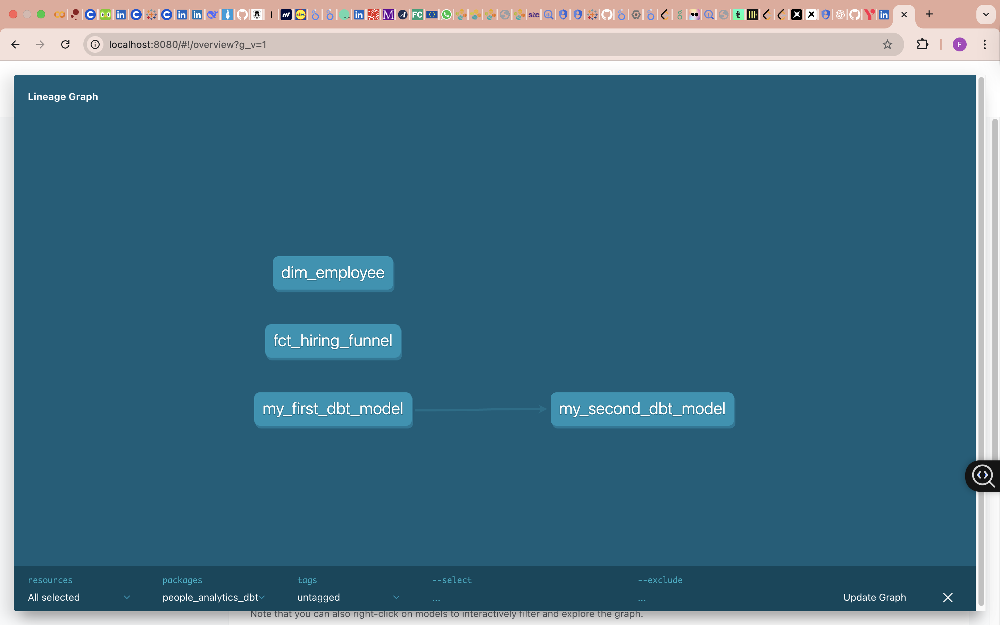

# Analytics Domain Ownership (dbt + BigQuery + Airflow)
[](https://github.com/FATIMA-FARMAN/analytics-domain-ownership/actions/workflows/dbt-ci.yml)

Domain ownership portfolio demonstrating **analytics engineering patterns** across **People Analytics** and **Payments** domains: dbt modeling, BigQuery cost-aware materialization, Airflow orchestration, tests/contracts, and lineage documentation.


---

## What this project demonstrates

- **Domain ownership**: each domain lives under `domains/<domain>/` with a consistent, maintainable structure.
- **Warehouse modeling discipline**: `staging → intermediate → marts (dim/fct)` with intentional materialization choices.
- **Cost-aware BigQuery patterns**: avoid `SELECT *`, reuse intermediates for expensive joins, and plan for partitioning/clustering on large facts.
- **Operational workflows**: Airflow DAGs orchestrate dbt runs; repo is cleaned to avoid committing generated artifacts (venv/logs/target).
- **Data quality + governance**: dbt tests and schema definitions support reliable downstream consumption.
- **Documentation + lineage**: dbt docs/lineage used for model discovery and impact analysis.

---

## Repository structure

```txt
analytics-domain-ownership/
  domains/
    people_analytics/
      dags/
      models/
      snapshots/
      seeds/
      tests/
      macros/
      packages.yml
      dbt_project.yml_


## Proof ✅

(BigQuery Sandbox Incremental)

- Compiled incremental SQL (shows incremental filter): `assets/proof/compiled_fct_hiring_funnel_incremental.sql`
- Screenshot: `assets/proof/12_incremental_compiled_sql.png`

> Note: BigQuery Sandbox blocks DML. `--full-refresh` works (CREATE TABLE). Incremental merge/upserts require billing.

### Airflow orchestration (UI)
- **DAGs listed / loaded**
  - 
- **Successful DAG run**
  - 

### dbt execution
- **dbt execution proof**
  - 

### BigQuery deployment
- **Dataset models (tables/views)**
  - 

### Lineage & documentation (optional)
- **dbt docs lineage**
  - 

## Quickstart (local)
```bash
# from repo root
cd domains/<domain>   # e.g., domains/people_analytics or domains/payments

python -m venv .venv
source .venv/bin/activate
pip install -r requirements.txt

dbt deps
dbt debug
dbt run
dbt test

# Start Airflow → trigger the DAG from the UI


### Airflow orchestration (UI)
**DAGs listed / loaded**  


**Successful DAG run**  


### dbt execution
**dbt execution proof**  


### BigQuery deployment
**Dataset models (tables/views)**  


### Lineage & documentation (optional)
**dbt docs lineage**  


### Data contracts & tests (dbt)
- dbt tests passing (People Analytics)
  - 
- dbt tests passing (Payments)
  - 

## Cost-aware warehouse notes (BigQuery)

This repository is intentionally structured to showcase **cost-aware analytics engineering** on BigQuery—optimizing for **lower scan cost**, **fast iteration**, and **predictable materialization choices**.

### Incremental model note (BigQuery Sandbox)

This model is implemented as a dbt incremental model with a timestamp-based filter.

In BigQuery Sandbox (free tier), DML operations required for incremental runs
(e.g. MERGE / INSERT) are not permitted. As a result:
- `dbt compile` demonstrates correct incremental SQL generation
- `dbt run --full-refresh` succeeds (DDL only)
- Standard incremental runs are intentionally blocked by the warehouse
This is a known BigQuery Sandbox limitation, not a modeling issue.

**Note (BigQuery Sandbox):** Standard incremental runs require DML (MERGE/INSERT), which is blocked in BigQuery Sandbox (free tier).  
This repo includes compiled SQL proof + a successful `--full-refresh` run to demonstrate the incremental pattern.


### Materialization strategy

- **Staging (`stg_*`)**: materialized as **views** to keep the warehouse lightweight and avoid duplicating raw/source data.
- **Intermediate (`int_*`)**: materialized as **tables** only when it pays off (reused joins/transforms that would otherwise be recomputed).
- **Marts (`dim_*`, `fct_*`)**: tuned for consumption.
  - Use **views** when you want low storage and acceptable latency.
  - Use **tables** when you need consistent dashboard performance or heavy reuse.

### Query efficiency principles

- Avoid `SELECT *` in marts; project only required columns to reduce **bytes scanned**.
- Centralize expensive logic into reusable intermediate models to prevent repeated recomputation across marts.
- Prefer BI-friendly marts to reduce query complexity and improve interactive performance.

### Partitioning & clustering (production pattern)

For large fact tables (e.g., `fct_*`):
- **Partition** by a date column (e.g., `event_date`, `snapshot_date`) to reduce scanned partitions.
- **Cluster** by common filter/join keys (e.g., `employee_id`, `department_id`) to improve pruning and join efficiency.
- Result: **lower scan cost** and **faster interactive queries**.

### Sandbox / billing constraints

- BigQuery Sandbox may restrict some **DML** operations; snapshot-style **SCD2** workflows typically require a billing-enabled project.
- This repo includes a **local proof path (DuckDB)** for incremental/SCD2 patterns when warehouse DML is restricted, while keeping BigQuery models focused on cost-aware views/tables.

### CI as a cost guardrail

To avoid unnecessary warehouse spend on every change:
- GitHub Actions runs `dbt deps` + `dbt parse` as a lightweight validation gate.
- Optionally run targeted `dbt test` on key marts (primary keys + relationships) instead of full refreshes.

```mermaid
flowchart TB

  subgraph ORCH["Airflow Orchestration"]
    DAG["dag_dbt_people_domain"] --> DEPS["dbt deps"] --> RUN["dbt run"] --> TEST["dbt test"]
  end

  subgraph SRC["Sources"]
    HRIS["HRIS"]
    ATS["ATS"]
    PERF["Performance"]
    COMP["Compensation"]
  end

  subgraph STG["Staging"]
    STG_HRIS["stg_hris_employees"]
    STG_ATS["stg_ats_candidates"]
    STG_PERF["stg_perf_reviews"]
    STG_COMP["stg_comp_salaries"]
  end

  subgraph INT["Intermediate"]
    INT_EMP["int_employee_enriched"]
    INT_FUN["int_hiring_funnel_steps"]
  end

  subgraph MART["Marts"]
    DIM_EMP["dim_employee"]
    FCT_FUN["fct_hiring_funnel"]
  end

  HRIS --> STG_HRIS
  ATS --> STG_ATS
  PERF --> STG_PERF
  COMP --> STG_COMP

  STG_HRIS --> INT_EMP --> DIM_EMP
  STG_ATS --> INT_FUN --> FCT_FUN
