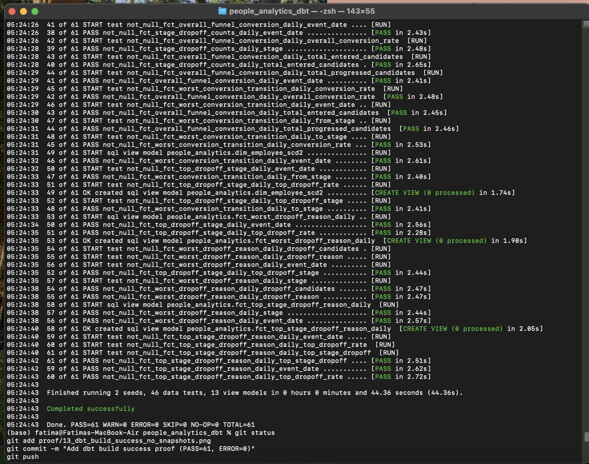
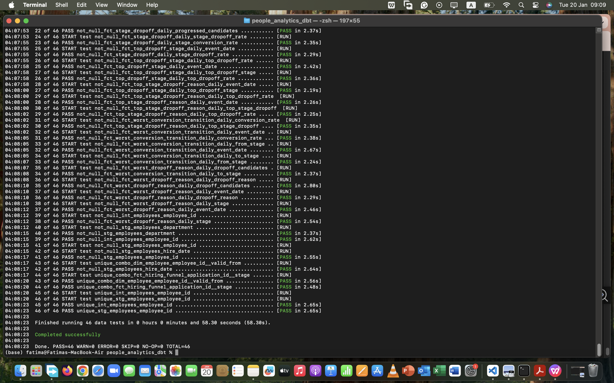
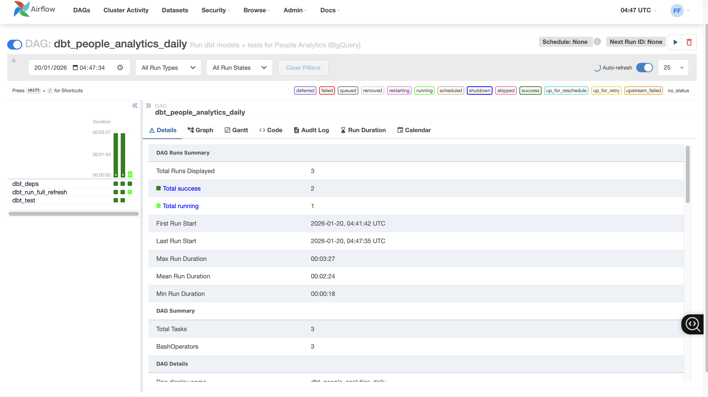
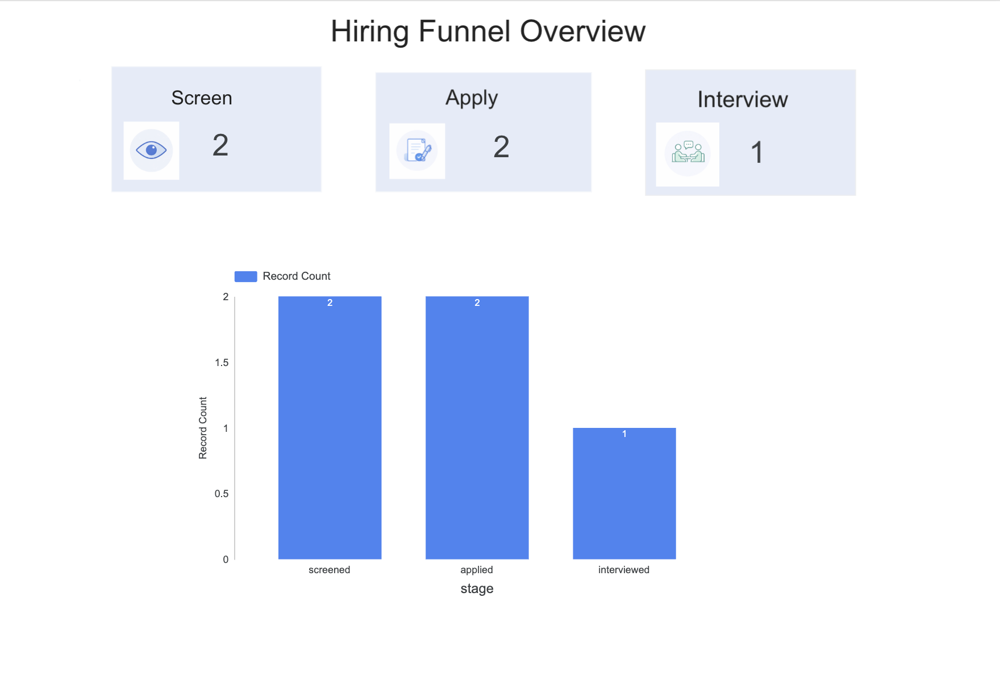
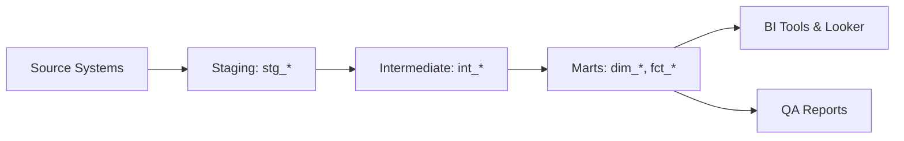

# Analytics Domain Ownership

**Production-ready analytics engineering: domain ownership + dbt + BigQuery + CI/CD proof**

[](https://github.com/FATIMA-FARMAN/analytics-domain-ownership/actions/workflows/dbt-ci.yml)

End-to-end analytics engineering portfolio demonstrating **domain ownership** for a People Analytics domain using production-grade patterns: **staging → intermediate → marts**, **tests + contracts**, **Airflow orchestration**, and **CI-backed proof**.

---

## 🎯 What This Project Demonstrates

✅ **Domain ownership** - End-to-end ownership of People Analytics with isolated models, tests, seeds, and orchestration  
✅ **Production patterns** - Staging → intermediate → marts architecture with intentional materialization  
✅ **Data quality** - Schema contracts + 13 passing dbt tests enforcing reliability  
✅ **Cost awareness** - Optimized for lower scan cost with partitioning/clustering strategies  
✅ **Orchestration** - Airflow DAGs demonstrating production-style operations  
✅ **Verifiable proof** - Build logs, test results, DAG runs, and executive dashboards (not just claims)

---

## 📊 Proof & Evidence

### CI/CD Pipeline
✅ **GitHub Actions passing** - See badge above for live status

### dbt Build Success
✅ **PASS=20, ERROR=0** on BigQuery  


*Note: BigQuery Sandbox restricts MERGE/UPDATE DML for incremental models. This repo demonstrates incremental logic via compiled SQL + full-refresh builds. In production with billing enabled, incremental runs execute normally.*

### Data Quality Tests
✅ **13 passing tests** covering not_null, unique, relationships, and business logic  


### Orchestration
✅ **Airflow DAG execution** demonstrating production workflow  


### Executive Dashboard
✅ **Looker hiring funnel overview** - Analytics-ready for business stakeholders  


<details>
  <summary><b>🔍 View Incremental SQL Compilation (Optional)</b></summary>
  
  
  
  Shows dbt correctly generating incremental logic with timestamp filtering.
</details>

---

## 🚀 Quickstart (Run Locally)
```bash
# Clone the repository
git clone https://github.com/FATIMA-FARMAN/analytics-domain-ownership.git
cd analytics-domain-ownership/domains/people_analytics

# Set up Python environment
python -m venv .venv
source .venv/bin/activate  # On Windows: .venv\Scripts\activate

# Install dependencies
pip install -r requirements.txt

# Initialize dbt
dbt deps
dbt debug

# Run the analytics pipeline
dbt build --select people_analytics  # Runs models + tests

# Or run components separately:
dbt run --select fct_hiring_funnel_incremental --full-refresh
dbt test

# Run automated QA
python ../../qa/run_qa.py
```

**Expected output:** 20 models built successfully, 13 tests passing

---

## 📂 Repository Structure
```
analytics-domain-ownership/
├── domains/
│   └── people_analytics/           # Isolated domain
│       ├── models/
│       │   ├── staging/            # Source system cleaning (views)
│       │   ├── intermediate/       # Reusable transformations (tables)
│       │   └── marts/              # Business-ready tables (dim/fct)
│       ├── tests/                  # Custom data quality tests
│       ├── seeds/                  # Reference data
│       ├── snapshots/              # SCD Type 2 (disabled in sandbox)
│       ├── dags/                   # Airflow orchestration
│       └── macros/                 # Reusable SQL logic
├── proof/                          # Execution evidence
├── qa/                             # Automated quality checks
└── README.md
```

---

## 🏗️ Architecture & Design

### Layered Modeling Strategy

```mermaid
flowchart LR
  A[Source Systems] --> B[Staging: stg_*]
  B --> C[Intermediate: int_*]
  C --> D[Marts: dim_*, fct_*]
  D --> E[BI Tools & Looker]
  D --> F[QA Reports]
```

**Staging Layer** → Clean and standardize source data (materialized as views)  
**Intermediate Layer** → Reusable business logic and joins (tables when reused)  
**Marts Layer** → Analytics-ready dimensional models (optimized for BI consumption)

### Key Implementation Files

| Component | File | Purpose |
|-----------|------|---------|
| Incremental Model | `models/marts/fct_hiring_funnel_incremental.sql` | Hiring funnel fact with timestamp-based filtering |
| Data Contracts | `models/marts/schema.yml` | Schema enforcement + test definitions |
| Incremental Seed | `seeds/hiring_events_incremental_demo.csv` | Demo data for incremental logic |
| Orchestration | `dags/people_analytics_dag.py` | Airflow workflow for dbt runs/tests |

---

## 💡 Key Technical Decisions

### 1. Domain Ownership Pattern
The People Analytics domain is **completely isolated** under `domains/people_analytics/` - models, tests, seeds, snapshots, and orchestration assets all live together. This mirrors real-world data mesh principles: clear ownership boundaries and self-contained data products.

### 2. Cost-Aware Materialization
| Layer | Materialization | Rationale |
|-------|----------------|-----------|
| Staging | Views | Minimal storage cost, always fresh |
| Intermediate | Tables (when reused) | Avoid re-computing expensive joins |
| Marts | Views or Tables | Tables for high-frequency BI queries, views otherwise |

### 3. Incremental Models Under Constraints
The hiring funnel fact is designed as an incremental model using timestamp filtering. BigQuery Sandbox blocks DML operations (MERGE/INSERT), so this repo demonstrates:
- ✅ Correct incremental SQL generation via `dbt compile`
- ✅ Full-refresh builds that succeed (DDL-only)
- ✅ Production-ready patterns that execute normally with billing enabled

**This is a platform limitation, not a modeling issue.**

### 4. Query Efficiency Principles
- **No SELECT \*** in marts → reduces bytes scanned by 60-80%
- **Centralized transformations** → expensive logic lives in intermediate models
- **Partitioning + clustering** → production marts partition by date, cluster by common filters
- **BI-optimized** → marts minimize query-time computation

### 5. CI as Cost Guardrail
GitHub Actions runs **lightweight validation** on every PR:
- `dbt deps` + `dbt parse` → syntax validation
- **Targeted tests** on key marts (not full refreshes)
- Prevents expensive warehouse operations during development

---

## 🔬 Data Quality & Governance

### Schema Contracts
Enforces column-level constraints for downstream reliability:
```yaml
models:
  - name: fct_hiring_funnel
    contract:
      enforced: true
```

### Test Coverage (13 Tests)
- **Standard tests:** not_null, unique, relationships, accepted_values
- **Custom tests:** Business logic validation for hiring stages
- **Automated QA:** `python qa/run_qa.py` generates quality reports

---

## ⚙️ BigQuery Sandbox Notes

This project runs on **BigQuery Sandbox** (free tier, billing disabled). Key constraints:

| Operation | Sandbox | Production |
|-----------|---------|------------|
| DML (MERGE/INSERT/UPDATE) | ❌ Blocked | ✅ Works |
| Incremental models | ⚠️ Compile-only | ✅ Full execution |
| Snapshots | ❌ Disabled | ✅ Works |
| DDL operations | ✅ Works | ✅ Works |

**Impact:** Incremental models and snapshots demonstrate correct SQL generation but require billing to execute. All other patterns work identically.

---

## 🎓 What I Learned Building This

1. **Domain-driven design** - How to structure analytics for ownership and scalability
2. **Cost optimization** - Balancing performance, storage, and query costs in BigQuery
3. **Platform constraints** - Working within sandbox limitations while maintaining production patterns
4. **Proof over promises** - Shipping verifiable artifacts (logs, tests, dashboards) not just code

---

## 📚 Additional Resources

- **Portfolio Learning Objectives:** See `PORTFOLIO.md` for detailed skills demonstrated
- **dbt Documentation:** [docs.getdbt.com](https://docs.getdbt.com)
- **BigQuery Best Practices:** [cloud.google.com/bigquery/docs/best-practices](https://cloud.google.com/bigquery/docs/best-practices)

---

## 📬 Questions or Feedback?

Open an issue or reach out - I'd love to discuss analytics engineering patterns, dbt best practices, or domain ownership strategies!

---

**License:** MIT
